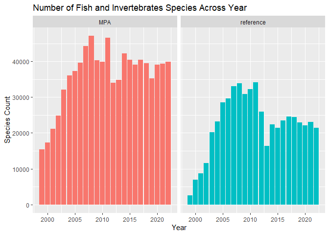

# proptfilio-pt1
Isabella Chan

``` r
library(tidyverse)
```

    ── Attaching core tidyverse packages ──────────────────────── tidyverse 2.0.0 ──
    ✔ dplyr     1.2.0     ✔ readr     2.2.0
    ✔ forcats   1.0.1     ✔ stringr   1.6.0
    ✔ ggplot2   4.0.2     ✔ tibble    3.3.1
    ✔ lubridate 1.9.5     ✔ tidyr     1.3.2
    ✔ purrr     1.2.1     
    ── Conflicts ────────────────────────────────────────── tidyverse_conflicts() ──
    ✖ dplyr::filter() masks stats::filter()
    ✖ dplyr::lag()    masks stats::lag()
    ℹ Use the conflicted package (<http://conflicted.r-lib.org/>) to force all conflicts to become errors

``` r
library(vegan)
```

    Loading required package: permute

``` r
library(ggpubr)
```

## Data Description

Identify your data source. \> It is a kelp forest data from the
Partnership for Interdisciplinary Studies of Coastal Oceans (PISCO)
(https://www.piscoweb.org/)
doi:https://doi.org/10.6085/AA/pisco_subtidal.161.2

Describe your data, including variables and data types.

``` r
fish <- read_csv("Data/1_PISCO_Fish_bysite.csv")
```

    Rows: 2545 Columns: 91
    ── Column specification ────────────────────────────────────────────────────────
    Delimiter: ","
    chr  (5): SITE, MPAGroup, site_designation, site_status, MLPA_REGN
    dbl (86): LATITUDE, LONGITUDE, YEAR_MPA, year, fishtrans, fish_CPUN, fish_GN...

    ℹ Use `spec()` to retrieve the full column specification for this data.
    ℹ Specify the column types or set `show_col_types = FALSE` to quiet this message.

``` r
invert <- read_csv("Data/2_PISCO_SwathInvert_bysite.csv")
```

    Rows: 2279 Columns: 84
    ── Column specification ────────────────────────────────────────────────────────
    Delimiter: ","
    chr  (5): SITE, MPAGroup, site_designation, site_status, MLPA_REGN
    dbl (79): LATITUDE, LONGITUDE, YEAR_MPA, year, swathtrans, swath_ANTSOL, swa...

    ℹ Use `spec()` to retrieve the full column specification for this data.
    ℹ Specify the column types or set `show_col_types = FALSE` to quiet this message.

> 1_PISCO_Fish_bysite.csv includes  
> categorical variables: SITE, MPAGroup, site_designation, site_status,
> MLPA_REGN, YEAR_MPA, year.  
> numeric variables: LATITUDE, LONGITUDE, fishtrans, fish_XXXX (average
> biomass across transects per site per year for different fish
> species)  
> 2_PISCO_SwathInvert_bysite.csv includes  
> categorical variables: SITE, MPAGroup, site_designation, site_status,
> MLPA_REGN, YEAR_MPA, year.  
> numeric variables: LATITUDE, LONGITUDE, fishtrans, swath_XXXX (average
> biomass across transects per site per year for different invertebrates
> species)

Identify the research questions you want to answer. \> How does species
biodiversity differ between Marine protected areas (MPA) and non Marine
protected areas?

## Data Visualization

What do you want your final visualizations to look like? \> Boxplots for
MPAs and non MPAs, measuring species diversity using different metrics.

What do you want to highlight on your final visualizations in order to
answer your research questions? How do you plan to do that? \> I want to
highlight if the differences observed is significant or not. I plan to
include astrids that represents the p-value.

What is missing from your data or would need to change in your data to
create these visualizations? \> The data are in two separate dataset. It
includes the average biomass across transects per site per year for each
species, but not species diversity calculated using different metrics
for each sites per year.

## Data Cleaning

The answer to at least three of these questions should be “YES” for the
data to meet the necessary standards to demonstrate your cleaning. Your
data source should not be an already perfectly prepared data set.

- Do you need to reformat any variables into different types
  (e.g. factors, time, dates, strings)? Or remove information from
  variable values? *Some variables are probably not the right type*
- Do you need to filter your data? How? *Dataset contains data from *
- Do you need to create any new variables? What variables? How? *yea I
  need to calculate the diversity using all species observed using the
  package `vegan`*
- Do you need to add new data (join) to your data? What data? How? *I
  need to join the fish and invertebrate data together*
- Do you need pivot your data in any way? Why? How? *I need to pivot the
  data to longer for calculation and data visualizations*
- Do you need to summarize any of the variables? Which ones? How?*I need
  to summarize all swath species and fish species*
- What other aspects of your data need to be “fixed” in order to make
  your data visualizations? *I want to use stat_compare_means to show
  the statistical significance on the graph*

Most will answer yes to the following for making your programming more
efficient using select(), but you should have three other yeses above.

- Are there any variables you can exclude from your data? *I can exclude
  the latitude and longtitude*

``` r
big <- fish |> 
  full_join(invert, by = join_by(SITE))
```

    Warning in full_join(fish, invert, by = join_by(SITE)): Detected an unexpected many-to-many relationship between `x` and `y`.
    ℹ Row 1 of `x` matches multiple rows in `y`.
    ℹ Row 1 of `y` matches multiple rows in `x`.
    ℹ If a many-to-many relationship is expected, set `relationship =
      "many-to-many"` to silence this warning.

``` r
big.clean <- big|> 
  select(c(SITE, LATITUDE.x, site_status.x, year.x, fish_CPUN:swath_TEST), -c(LATITUDE.y:swathtrans)) |> 
  filter(LATITUDE.x < 37) |> 
  drop_na(site_status.x) 

big.long <- big.clean |> 
  pivot_longer(cols = fish_CPUN:swath_TEST,
               names_to = "species",
               values_to = "Value") |> 
  group_by(SITE, site_status.x) |>  
  summarise(Observed = specnumber(Value),
            Shannon = diversity(Value, index = "shannon"),
            InvSimpson = diversity(Value, index = "inv"),
            Biomass = sum(Value)) |> 
  pivot_longer(cols = Observed: Biomass,
               names_to = "metrics",
               values_to = "value")
```

    `summarise()` has regrouped the output.
    ℹ Summaries were computed grouped by SITE and site_status.x.
    ℹ Output is grouped by SITE.
    ℹ Use `summarise(.groups = "drop_last")` to silence this message.
    ℹ Use `summarise(.by = c(SITE, site_status.x))` for per-operation grouping
      (`?dplyr::dplyr_by`) instead.

``` r
big.year <- big.clean |> 
  pivot_longer(cols = fish_CPUN:swath_TEST,
               names_to = "species",
               values_to = "Value") |> 
  group_by(SITE, site_status.x, year.x) |>  
  summarise(Observed = specnumber(Value))
```

    `summarise()` has regrouped the output.
    ℹ Summaries were computed grouped by SITE, site_status.x, and year.x.
    ℹ Output is grouped by SITE and site_status.x.
    ℹ Use `summarise(.groups = "drop_last")` to silence this message.
    ℹ Use `summarise(.by = c(SITE, site_status.x, year.x))` for per-operation
      grouping (`?dplyr::dplyr_by`) instead.

## Part 2

``` r
ggplot(big.long,
       aes(x = site_status.x,
           y = value,
           color = site_status.x)) +
  geom_boxplot() +
  facet_wrap(vars(metrics), nrow = 1, scales = "free_y") +
  stat_compare_means(method = "wilcox.test",
                     comparisons = list(c("MPA", "reference")),
                     method.args = list(alternative = "greater"),
                     label = "p.signif",
                     symnum.args = list(cutpoints = c(0, 0.0001, 0.001, 0.01, 0.05, 1),
                                        symbols = c("****", "***", "**", "*", "ns"))) +
  labs(y = "Alpha Diversity Measures",
       x = "Site Status",
       title = "Alpha Diversity in MPAs and non MPAs") +
  theme(legend.position = "none")
```

    Warning: Removed 128 rows containing non-finite outside the scale range
    (`stat_boxplot()`).

    Warning: Removed 128 rows containing non-finite outside the scale range
    (`stat_signif()`).


``` r
ggplot(big.year) + 
  geom_col(aes(x = year.x,
               y = Observed,
               fill = site_status.x)) +
  facet_wrap(vars(site_status.x)) +
  labs(x = "Year",
       y = "Species Count",
       title = "Number of Fish and Invertebrates Species Across Year") +
  theme(legend.position = "none")
```

    Warning: Removed 91 rows containing missing values or values outside the scale range
    (`geom_col()`).


